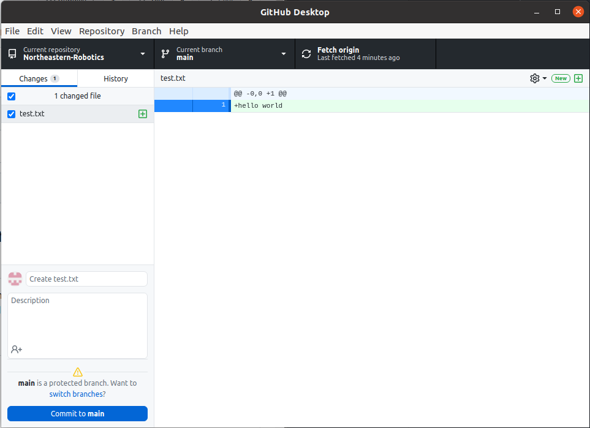

# Standard Operating Procedures for Northeastern Robotics GitHub
This file will outline all of the requirements each collaborator should follow in order to help develop code. Tutorials are also available in order to show how to use git on the command line along with the GitHub Desktop alternative.

## Table of contents
1. [Principle of GitHub and Standard Workflow](#workflow)
2. [Setting Up Git (Command Line)](#cmd_install)
3. [Setting up GitHub Desktop](#desktop-install)
4. [Code Standards](#coding_practices)
    1. [Comments](#comments)
    2. [Classes](#classes)
    3. [Naming Conventions](#naming)
5. [GitHub Standards](#github_practices)

## Principle of GitHub and Standard Workflow<a name = "workflow"/>
Hello World

## Setting Up Git (Command Line)<a name="cmd_install"/>
Hello World

## Setting Up GitHub Desktop (Recomended)<a name="desktop-install"/>
This is how to set up and use GitHub on desktop (available for all operating systems).

Here is what the standard GitHub desktop application looks like:


## Coding Standards<a name = "coding_practices" />
Since this code will be shared between members, rewritten, and moderated by team leaders. All code that is pushed is expected to follow each guideline presented. Code that does not will not be merged into the main branch.

(Full documentation for conventions for [Python](https://www.python.org/dev/peps/pep-0008/) and [C++](https://google.github.io/styleguide/cppguide.html). Note, mostly everything here and in these are not all exactly required, there is some flexibility. But the goal is to have all code in our repositories being cohesive and understandable)

### Comments<a name = "comments" />
Comments should be concise, easy to read, and explanatory. The expectation is comments should match a level where the reader knows progammming and basic/common concepts, but does not know the specifics of the code being commented. Nearly every line/concept should be commented. Just commenting at the top of functions/classes is not enough.

Here are the [required rules for commenting](https://stackoverflow.blog/2021/07/05/best-practices-for-writing-code-comments/) (click link for more details on each one):
1. Comments should not duplicate the code
2. Good comments do not excuse unclear code
3. If you can't write a clear comment, there may be a problem with the code
4. Comments should dispel confusion, not cause it
5. Explain unidiomatic code in comments
6. Provide links to the original source of copied code
7. Include links to external references where they will be most helpful
8. Add comments when fixing bugs
9. Use comments to mark incomplete implementations

For more in depth and language specific examples, click for the full [Python](https://developer.lsst.io/python/numpydoc.html) and [C++](https://developer.lsst.io/cpp/api-docs.html#documentation-must-be-delimited-in-javadoc-style) commenting guidelines.

### Comments for classes and functions
Here is an example of a well commented function. All functions in pushed code should look like this and follow very similar if not exact formatting. 
<table style='table-layout:fixed'>
<tr>
<th>Python</th>
<th>C++</th>
</tr>
<tr>
<td>

```python
def my_function(p1, p2, p3):
  """my_function does blah blah blah
    Parameters:
      p1 (type): Description of p1
      p2 (type): Description of p2
      p3 (type): Description of p3
    Returns:
      Describe what it will return. Omit if nothing
  """
  
  #Code for the function goes here
```
</td>
<td>

```C++
  /**
   * Description of function
   *
   * @param p1 Description of p1
   * @param p1 Description of p2
   * @param p3 Description of p3
   * @return Describe what to return. If nothing, remove this line
   */
  int my_function(int p1, int p2, int p3)
  {
    //Code for the function goes here
  }
```
</td>
</tr>
</table>

For classes, the structure is similar. Please follow these guidlines when coding classes.
<table style='table-layout:fixed'>
<tr>
<th>Python</th>
<th>C++</th>
</tr>
<tr>
<td>

```python
class Person:
    """
    A class to represent a person.

    ...

    Attributes
    ----------
    name : str
        first name of the person
    surname : str
        family name of the person
    age : int
        age of the person

    Methods
    -------
    info(additional=""):
        Prints the person's name and age.
    """
  
  #Code for the class goes here
```
</td>
<td>

```C++
/**
 * Implementation of a trace facility for LSST
 *
 * Tracing is controlled on a per "component" basis, where a "component" is a
 * name of the form aaa.bbb.ccc where aaa is the Most significant part; for
 * example, the utilities library might be called "utils", the doubly-linked
 * list "utils.dlist", and the code to destroy a list "utils.dlist.del"
 *
 */
class TraceImpl
{
    public:
        ...
}
```
</td>
</tr>
</table>

### Classes<a name = "classes" />

All classes, depending on the language, should have a few basic functions. The required functions for all languages are as follows:
* Default constructor (and destructor if necessary)
* String methods to allow for easy printing/debugging

#### Python

All classes should have as many "magic methods" as possible (https://rszalski.github.io/magicmethods/)
The ones required for classes are the __str__ and __repr__. Both methods are shown in the code example below, and the key reason it to make debugging easier as it prints out a readable format for your class. Here are good examples for a class Person that has a name and age attribute (although comments are omitted here for the sake of brevity, these should be commented):
<table style='table-layout:fixed'>
<tr>
<th>__repr__</th>
<th>__str__</th>
</tr>
<tr>
<td>

```python
  def __repr__():
    return "Person(" + str(name) + ", " + str(age) + ")"
```
</td>
<td>

```Python
  def __str__():
    return "Name: " + str(name) + ", Age: " + str(age) + "\n"
```
</td>
</tr>
</table>

Note the main differences between the __str__ function and the __repr__ function. The str function is supposed to be human readable. This should print out all of the variable states that are deemed relevant in order to get an overview of the current state of that particular object. The __repr__, on the other hand, should be a short string that indicates its class, and as shown above, maybe one or two defining features shown in the parenthesis. This is not neccesary though, but for small classes having that information may deem helpful.

#### C++

C++ classes that are complicated and lengthy should be defined using a header file as well as a cpp file, using #ifndef statements to avoid errors. Smaller classes can skip the header file, but classes must be in their own C++ file along with their operator methods and any other helper methods directly related to the base implementation of the class.

C++ classes should provide an insertion operator as well as a to_string() method. Examples for a class Person, which has a name and age, are shown below:

<table style='table-layout:fixed'>
<tr>
<th>Insertion Operator</th>
<th>to_string</th>
</tr>
<tr>
<td>

```C++
    //Note, this method is NOT inside the class, it is defined outside. (should be declared in .h, implemented in .cpp)
    std::ostream& operator <<(std::ostream& ours, ClassName name)
    {
        return outs << "ClassName("<<name.getProperty()<<")";
    }
```
</td>
<td>

```C++
    //Note how in this example, they use the previously defined << operator to make things simpler.
    //Note, this is NOT inside the class. It is defined outside.
    std::string to_string(ClassName name)
    {
        std::ostringstream ssl
        ss << name;
        return ss.str()
    }
```
</td>
</tr>
</table>

Both of these should be descriptive and say everything necessary that someone might want to print about a class. Make sure not to add newlines or "endl" at the end as that should be left to the user implementing these functions.

### Naming Conventions<a name = "naming" />
Naming conventions are varied depending on where you look and for what language, but for the most part names just need to be clear. For our purposes, the following naming conventions can be followed:
<table>
<thead>
  <tr>
    <th></th>
    <th>Convention</th>
    <th>Example</th>
  </tr>
</thead>
<tbody>
  <tr>
    <td>Classes</td>
    <td>Capitalised and Mixed Case</td>
    <td>RobotDog</td>
  </tr>
  <tr>
    <td>Functions</td>
    <td>Lowercase and mixed case, formatted as a question/command</td>
    <td>isEqual(), getProperty()</td>
  </tr>
  <tr>
    <td>Variables</td>
    <td>Lowercase with underscores in between words. No numbers of special characters (other than underscores). <br>Should be as descriptive as possible. <br>The one exception is looping variables (such as i, x, j, etc) where the sole purpose is for a loop iterator.</td>
    <td>maxmimum_value, robot_dog</td>
  </tr>
  <tr>
    <td>Constants</td>
    <td>All capital letters with underscores</td>
    <td>PI, TOTAL_VALUE</td>
  </tr>
  <tr>
    <td>File names</td>
    <td>lowercase and Mixed Case</td>
    <td>helperFile.py</td>
  </tr>
</tbody>
</table>

## GitHub Standards<a name = "github_practices" />
Hello World
